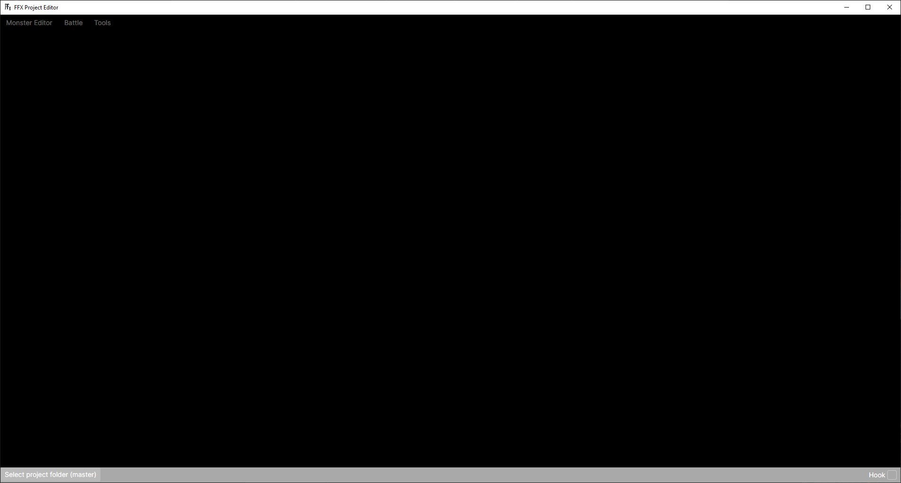
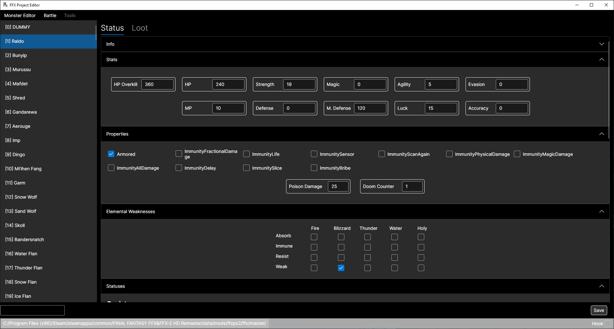
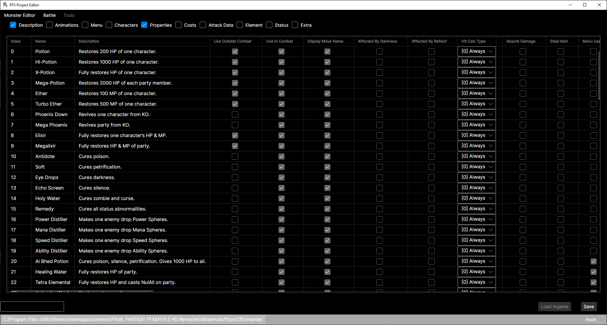
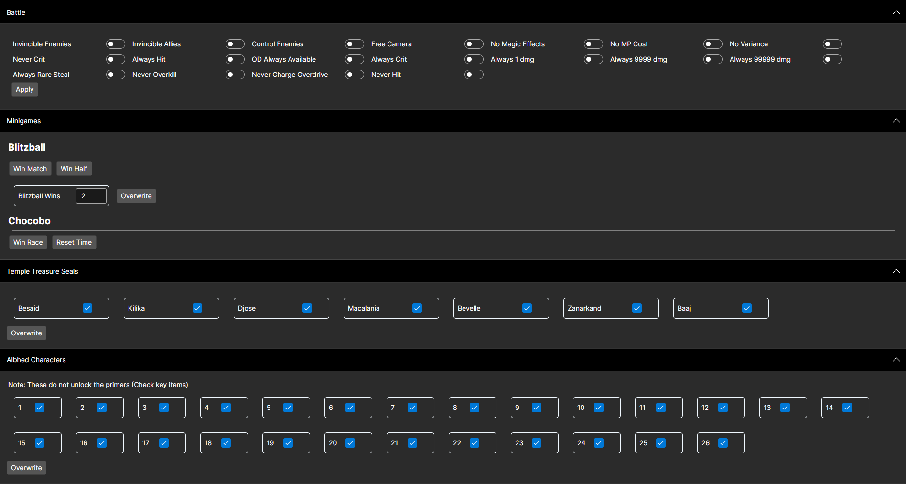
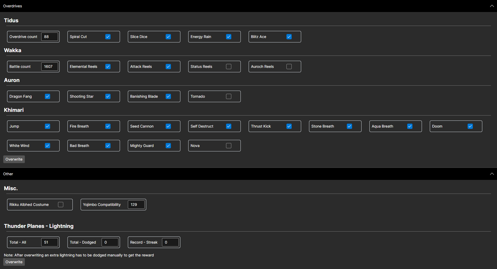
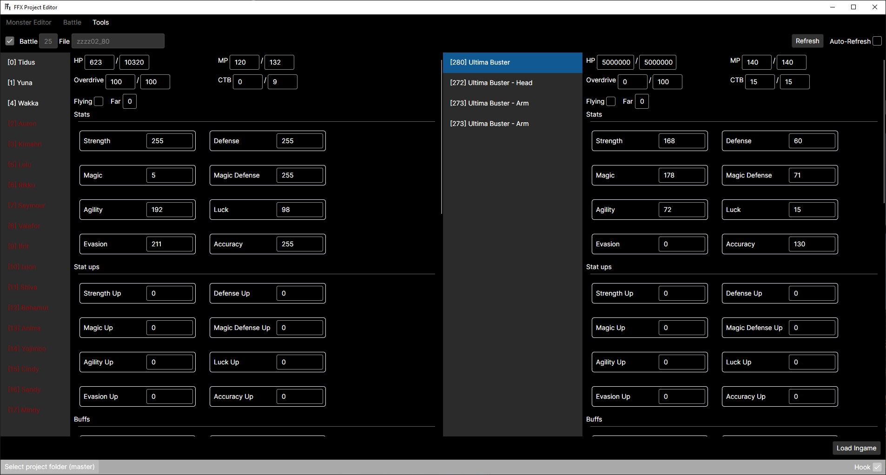
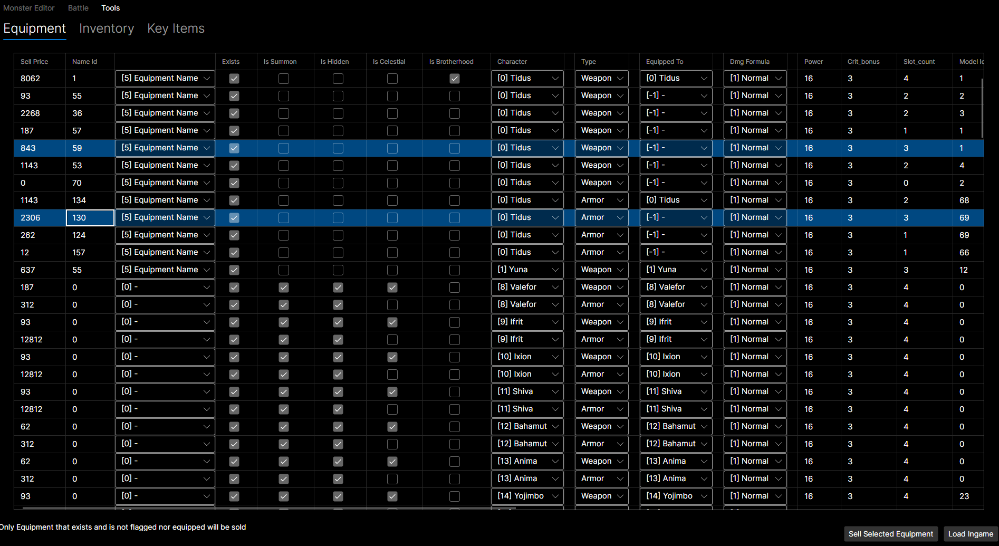
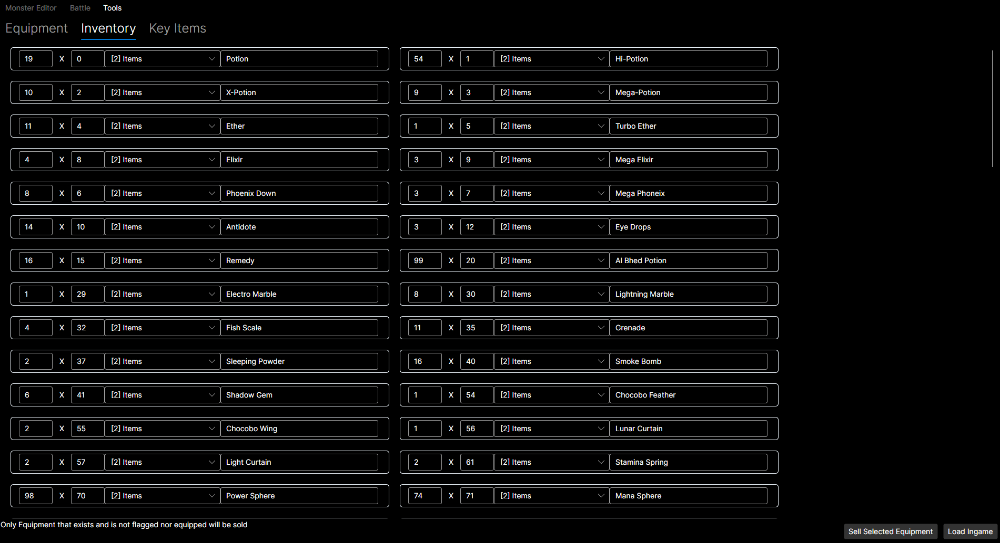
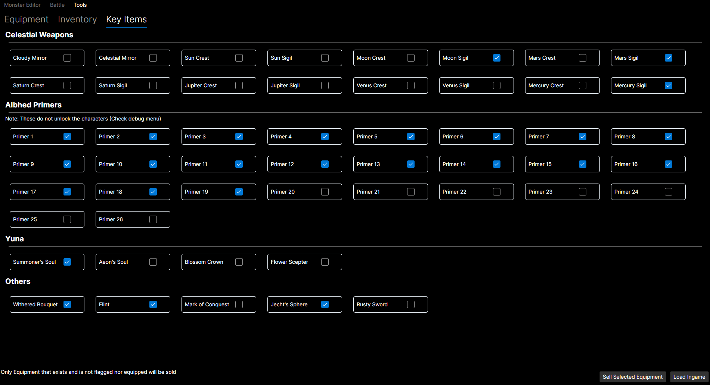
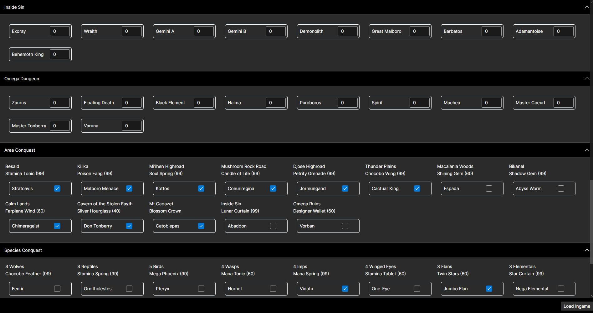

# FF X Project Editor

A multiplatform solution to edit the files from the game "Final Fantasy X".

If you only want to use the tools, simply open the app when the game is open and use them, no need to set anything up.

* Tools are only compatible with the Steam version in Windows.
* Tools are compatible with [Untitled Project X](https://steamcommunity.com/sharedfiles/filedetails/?id=683802394)

## How to set it up

Download the executable from the [Releases](https://github.com/osdanova/FFXProjectEditor/releases) section.

* Windows: win-x64
* Linux: linux-x64

Extract the game files using an extractor such as [VBF Browser](https://www.nexusmods.com/finalfantasy12/mods/3).

The folder that the app uses (Needs to be loaded) is ffx_ps2/ffx/master. Inside this folder there are folders containing data for every region. Currently this tool only supports US (Both new_uspc and jppc are needed)

I recommend using the [External File Loader](https://www.nexusmods.com/finalfantasyxx2hdremaster/mods/150). This will create a folder called mods inside your FFX folder where your custom files will be located and loaded by the game. Once installed, copy your master folder to mods/ffx_ps2/ffx/ and load that folder in the editor to immediately modify the files your game loads.

## How to use

Click on "Select Project Folder" at the bottom left and load your master folder. The app autodetects when your game is open and it'll hook to it when it is (Bottom right checkbox)

## File Modding

* Available: When a project is loaded.

### Monster Editor

* Live testing: Loaded when combat starts so once a monster is saved the new data will apply to the next encounter.

Edit the stats of all the monsters in the game. 

### Items / Command / Monster Commands

* Live testing: Loaded when the game starts. The "Load Ingame" button can be used to see changes without reloading.

All of these files share their structure.

* Items: Game items
* Command: The commands used by the party
* Monster Commands: Commands used by enemies

## Tools

* Available: When the game has been hooked to the app.

Tools to play around with the game.

### Debug Menu

A configuration menu with debug options.

 

### Battle Tracker

A Menu to see and modify ally and enemy data. Note that the autorefresh can be enabled but editing and loading data is disabled while it is autorefreshing.

### Inventory Tracker

See all of your inventory and edit it as you need. You can also sell equipment in bulk!

 

 

### Arena Tracker

Keep tabs on your arena captures.

## Made with

* .Net
* Avalonia UI
* MemorySharp (Compiled branch that supports x64 apps)

## Special Thanks

The knowledge on the files was shared by the FFX community folks. Check out the [Fahrenheit project](https://github.com/peppy-enterprises/fahrenheit/tree/main) to learn more!